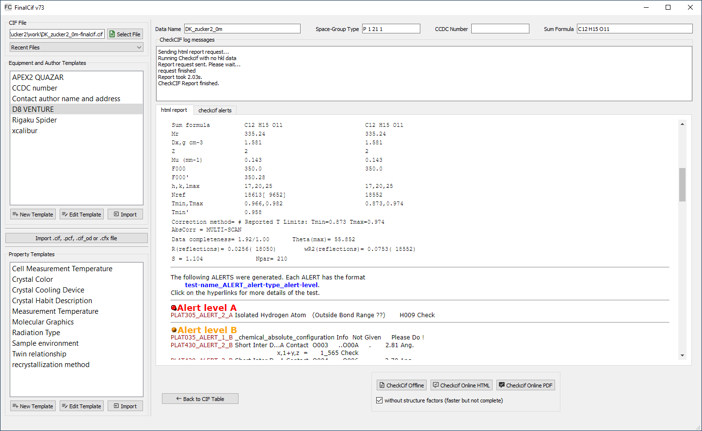
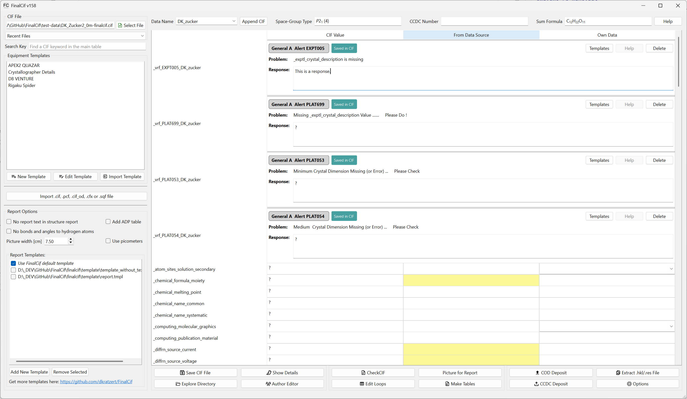
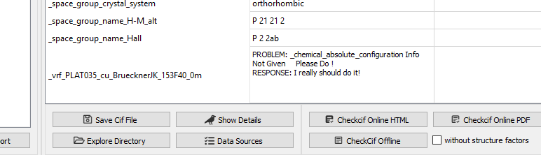

CheckCif
========

FinalCif can help you doing CheckCIF. Three options are available:

* Online with html report
* Online with pdf report
* Offline with your local PLATON installation

The two online options send the CIF to the IUCr server https://checkcif.iucr.org/ and do a CheckCIF run there.
The offline option will never send the CIF anywhere. It runs on your own computer using PLATON.
Since version 154, a special version of PLATON (https://www.platonsoft.nl/platon/) is distributed together
with FinalCif, so no separate installation is needed for offline CheckCIF on Windows.
On other platforms, PLATON has to be installed and reachable by the system's PATH variable.

Any CheckCIF can be performed with or without structure factors (hkl data). Without structure factors
has the advantage of being fast, but the resulting checks are far less thorough.

**Citations for CheckCIF and PLATON**

When using the CheckCIF service or PLATON for structure validation, please cite:

* IUCr CheckCIF/PLATON service: https://checkcif.iucr.org/
* A. L. Spek, *Acta Cryst.* **2009**, *D65*, 148–155, doi:`10.1107/S090744490804362X <https://doi.org/10.1107/S090744490804362X>`_.
* A. L. Spek, *Acta Cryst.* **2015**, *C71*, 9–18, doi:`10.1107/S2053229614024929 <https://doi.org/10.1107/S2053229614024929>`_ (for SQUEEZE).

See also the :ref:`citations` page for a full list of software citations.

**CSD Duplicate Check**

When performing an online CheckCIF (since version 155), you can enable the option to check for duplicate
structures in the Cambridge Structural Database (CSD). This option is available as a checkbox in the
CheckCIF section. It adds an additional check during the CheckCIF run to see whether a similar structure
has already been deposited.

   Results from a checkcif run.

Validation Response Forms (_VRF)
--------------------------------
Sometimes you have to explain certain alerts from CheckCIF. For example regarding the experiment resolution.
This is done via validation response forms. FinalCif has a convenient method to do so.
After a "CheckCIF Online HTML" with structure factors you have the option to click on "Edit Response Forms".
There you have the possibility to reply to A, B or C level alerts and save them to the CIF.
This works also with multi-CIFs. The respective data block name after the alert numbers indicates
the respective CIF file.

Common responses can be saved for later use. See the templates section how to do this.

   Validation response form editor.

----

A resulting response form:

   A single response form in the FinalCif main table.

Structure of a validation response form
---------------------------------------

.. code-block::

    _vrf_<alert>_<data block>
    ;
    PROBLEM: <alert description>
    RESPONSE:
    <free text>
    ;

1. <alert> corresponds to the alert code in CheckCIF which is the part until the first underscore.
   E.g., in "PLAT911_ALERT_3_C", it would be "PLAT911".
   The alert level "ALERT_x_A/B/C" cannot be included.
2. The line starting with "PROBLEM" is optional and can be omitted. Entering the "wrong" text for
   a given alert, won't change anything.
3. The line "RESPONSE:" is essential. If this line is missing, the VRF will not be recognized.
4. There is only one VRF possible per error code. Replies to multiple alerts with the same code,
   even if on different A, B or C level and for different atoms, have to be grouped in one VRF
   reply.
5. <data block> is the datacode after the data block indicator "data_<data block>". FinalCif
   automatically renames the <data block> item of the vrf if you rename the <data block> of the
   CIF file.