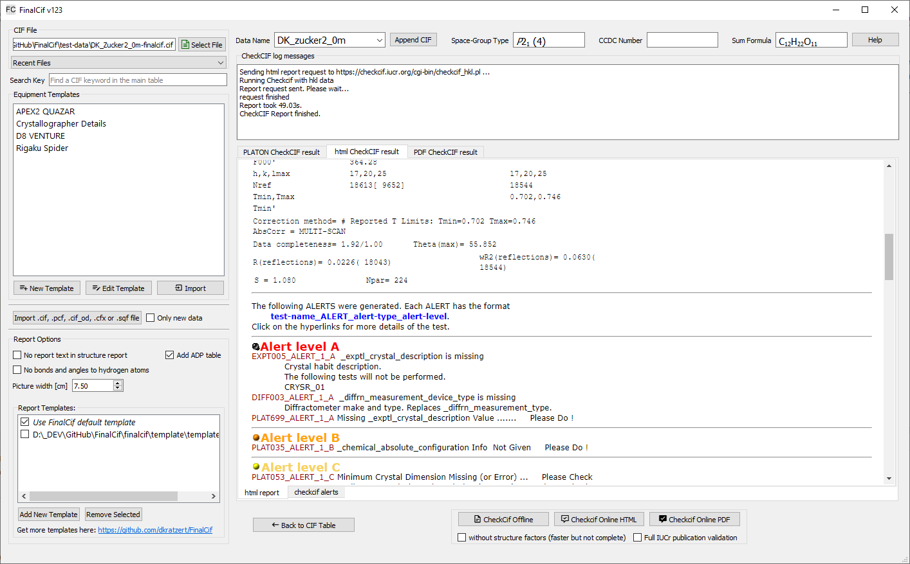

CheckCif
========

FinalCif can help you doing checkcif. Three options are available:

* Online with html report
* Online with pdf report
* Offline with your local PLATON installation 

The two online option send the CIF to the IUCr server https://checkcif.iucr.org/ and do a CheckCif run there.
The offline option will never send the CIF anywhere. It runs on your own computer, but PLATON has to be installed
and reachable by the systems PATH variable.
any Checkcif can be performes with or without structure factors (hkl data). Without structure factors has the
advantage of beeing fast, but the resulting ckecks are far less deeply. 

Results from a checkcif run.

Validation Response Forms
-------------------------
Sometimes you have to explain certain alerts from CheckCif. For example rearding the experiment resolution.
This is done via validation response forms. FinalCif has a convenient method to do so.
After an Online CheckCif with structure factors you have the option to click on "Edit Response Forms".
Ther you have the possibility to reply to A and B level alerts and save them to the CIF:

Validation response form editor.

----

A resulting response form:

.. image:: pics/response_cell.png
A single response form in the FinalCif main table.

