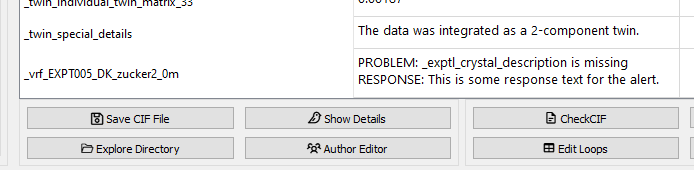

CheckCif
========

FinalCif can help you doing CheckCIF. Three options are available:

* Online with html report
* Online with pdf report
* Offline with your local PLATON installation 

The two online option send the CIF to the IUCr server https://checkcif.iucr.org/ and do a CheckCIF run there.
The offline option will never send the CIF anywhere. It runs on your own computer, but PLATON has to be installed
and reachable by the systems PATH variable.
any CheckCIF can be performes with or without structure factors (hkl data). Without structure factors has the
advantage of beeing fast, but the resulting ckecks are far less deeply. 

.. figure:: pics/finalcif_checkcif.png
   :width: 700

   Results from a checkcif run.

Validation Response Forms (_VRF)
--------------------------------
Sometimes you have to explain certain alerts from CheckCIF. For example regarding the experiment resolution.
This is done via validation response forms. FinalCif has a convenient method to do so.
After a "CheckCIF Online HTML" with structure factors you have the option to click on "Edit Response Forms".
There you have the possibility to reply to A, B or C level alerts and save them to the CIF.
This works also with multi-CIFs. The respective data block name after the alert numbers indicates
the respective CIF file.

Common responses can be saved for later use. See the templates section how to do this.

.. figure:: pics/finalcif_responses.png
   :width: 700

   Validation response form editor.

----

A resulting response form:

   A single response form in the FinalCif main table.

Structure of a validation response form
---------------------------------------

.. code-block::

    _vrf_<alert>_<data block>
    ;
    PROBLEM: <alert description>
    RESPONSE:
    <free text>
    ;

1. <alert> corresponds to the alert code in CheckCIF which is the part until the first underscore.
   E.g., in "PLAT911_ALERT_3_C", it would be "PLAT911".
   The alert level "ALERT_x_A/B/C" cannot be included.
2. The line starting with "PROBLEM" is optional and can be omitted. Entering the "wrong" text for
   a given alert, won't change anything.
3. The line "RESPONSE:" is essential. If this line is missing, the VRF will not be recognized.
4. There is only one VRF possible per error code. Replies to multiple alerts with the same code,
   even if on different A, B or C level and for different atoms, have to be grouped in one VRF
   reply.
5. <data block> is the datacode after the data block indiator "data_<data block>". FinalCif
   automatically renames the <data block> item of the vrf if you rename the <data block> of the
   CIF file.