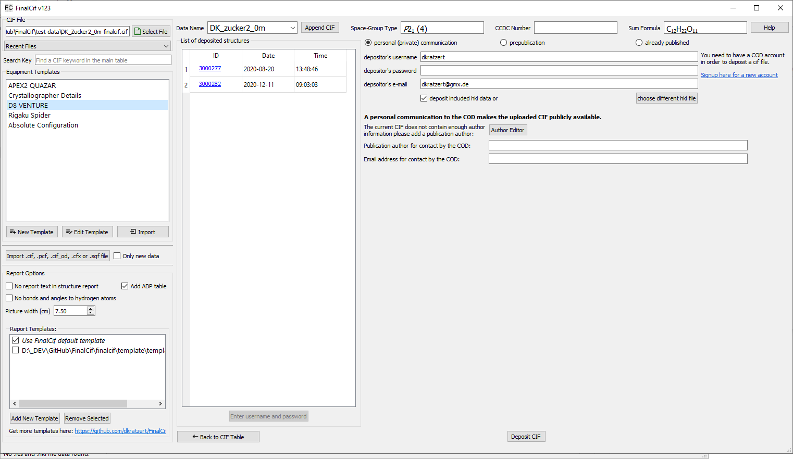

Database Deposition
===================

In order to archive CIF files and to make them publicly available, there are two major databases for deposition. The most
commonly used is the Cambridge Structural Database (CSD, https://www.ccdc.cam.ac.uk/).
A younger database is the Crystallography Open Database (COD, https://www.crystallography.net/cod/).
While the CSD ist a commercial product with an annual pricing, the COD is open for everyone.

FinalCif has two buttons for depositing in the respective database, but they behave very differently.
The button for the CSD ("CCDC Deposit") only points to the CSD website, while the button for the COD ("COD Deposit") opens
an upload interface in FinalCif.

The COD deposition interface

The COD interface has three major options: "personal communication", "prepublication" and "already published"
Before the first upload attempt, you have to signup for an account at http://crystallography.net/cod/. With that username,
password and email adress, you can use the FinalCif interface.
On the left hand side, you see a list of already deposited structures, unless you entered username/password and refreshed the list.

personal communication (private communication)
----------------------------------------------

The personal communication acts like a publication in a journal. The CIF immediately becomes publicly available.
Therefore, you must add at least one author name to the submitted CIF in the FinalCif author editor if there is not
already an author in the CIF.
This or these author(s) must not be a communication author, but a communication author can be added additionally.

prepublication
--------------

The prepublication option is the choice for deposition prior to a publication in a scientific journal. As with personal communications,
you have to submit at least one author. Additionally, you have to give a journal name and the hold period until the COD will
contact you in order to ask about the current status of the publication. During the hold period, The CIF is only accessible by
the depositor unless it is either published in a journal or as personal communication in the COD.

already published
-----------------

The already published option is for structures that have already been published in a journal and which have a DOI (https://www.doi.org/).
In order to deposit an already published CIF, you have to insert the publication DOI into the respective field and click "Get Citation".
After the publication information was fetched, you can upload the CIF.