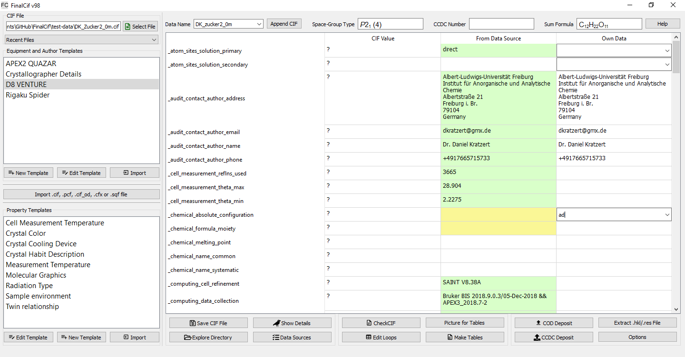
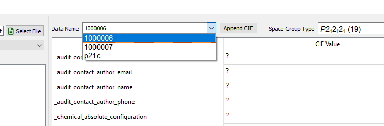

Introduction
============

CIF files from SHELXL miss a lot of information that should be added prior to publication. Editting CIF files with
text editors is a tedious task and often leads to errors. Therefore, FinalCif tries to help you with this task.
Essentially, you must have the corresponding CIF file for FinalCif in its original 'work' folder, which contains
all other files such as SAINT list files, SADABS list file, SHELX list files, etc. that led to this cif file.
The main table of FinalCif has three columns. The most left contains the information from the .cif file. Data from
other sources like the .p4p file is displayed in the middle column and user information can be put into the right-most
column. The data typed by the user always rules out the other information. The two different templates on the left
can be used to fill in author information or machine models (top) as well as to create dropdown menus for specific
CIF keywords (bottom). Any keyword not already in the CIF file will be added by the template. In the dropdown menus,
you can be creative to specify the crystallization conditions with a template.

The CIF keywords with a question mark as value are at the beginning of the man table in FinalCif and the keywords with
values are below.

Each input field in FinalCif accepts Unicode characters like "ω" or "ä". They are automatically
translated into the CIF ascii format.
Please let me know if a character does not work. Also the length of text lines are nor concern,
finalCif handles the maximum line lenght
according to the CIF format definition automatically.

Various possibilities of Checkcif are available, online with html or pdf result and offline.
The button "save cif file" saves the current file under 'name'-finalcif.cif. FinalCif will never make Changes to the
original CIF file. 

The FinalCif executable accepts a file name as first argument in order to open .cif files from
other programs like ShelXle.

   The FinalCif main window.

**A workflow example**

* Open a cif file in a work folder.
* Check and edit the remaining items.
* Do a html checkcif (it also saves an image for the report). Probably correct last items
  like the moiety formula and  explain alerts with the validation response form editor in the
  same window.
* Do a pdf checkcif
* Submit the CIF to the CCDC
* Drag&drop the CCDC deposit reply email into the work folder, or edit the CCDC number manually
* Click on „Make Tables“

**Files used by FinalCif**

* SADBABS .abs
* SAINT _0m._ls, _01._ls
* Bruker _0m.p4p
* One frame like _ib_01_0001.sfrm
* A .eml email file for the CCDC number
* the .hkl and .res file content of the CIF itself

**Non-Bruker Data**

For Rigaku and STOE datasets, it is not necessary for FinalCif to collect information from various files. 
Instead, it is sufficient to import a certain CIF created during the experiment. Rigaku produces a '.cif_od' file
and STOE a '.cfx' file for example. Also the Bruker '.pcf' file is importable. You can import any additional CIF 
formated file with the 'Import' button on the left center.
This will import all key/values and loops from the file except for unit cell and space group information.

**CIF format specification**

FinalCif uses the `IUCr CIF specification 1.1 <https://www.iucr.org/resources/cif/spec/version1.1/>`_.
Among other minor restrictions, this means that the global\_ keyword `is not allowed in CIF 1.1
<https://www.iucr.org/resources/cif/spec/version1.1/cifsyntax#global>`_.
Some CIF writing programs still use the global\_ keyword. You may circumvent this by exchanging the
global\_ key with a data\_ keyword and delete the previous data\_.

Since version 99, FinalCif supports multi-CIFs, so CIF files with multiple data\_ blocks can be
opened and edited. Please note that auto-filling of missing values is disabled in multi-CIF mode.

   Selector for data blocks in a multi-CIF.

**Help for CIF keywords**

A click on one of the CIF keywords in the vertical header of the main table pops up a window
with explanations about the specific keyword.