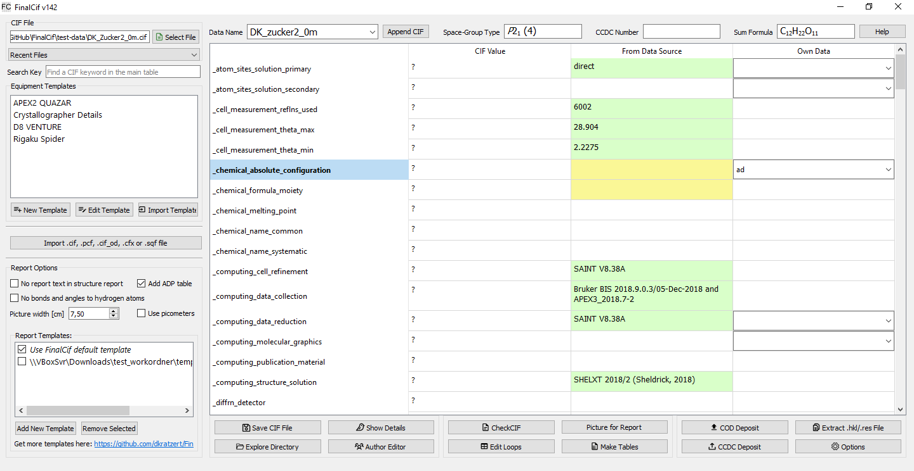

Introduction
============

CIF files from SHELXL often lack key details needed for publication. Editing these files manually can lead to errors.
FinalCif helps by pulling information from the corresponding ‘work’ folder, which contains files like
SAINT, SADABS, and SHELX list files.

FinalCif's main table displays the .cif file data in three columns: the left shows the original CIF data, the middle
displays data from other sources (like the .p4p file), and the right allows user input, which overrides all other values.
Templates make it easy to add author info, machine models, or create dropdowns for specific CIF keywords.

Fields marked with a question mark require attention and appear at the top of the table.
Each input field supports Unicode characters like umlauts, which are automatically converted to CIF-compliant ASCII format.
Input fields are also validated, turning red if invalid data is entered.

You can run CheckCif online (HTML/PDF) or offline from within FinalCif to check the result. The button "save cif file" saves
under ‘name’-finalcif.cif, leaving the original file unchanged.
The FinalCif executable also accepts file names as arguments to open .cif files from other programs like ShelXle.

   The FinalCif main window.

**A workflow example**

* Open a cif file in a work folder.
* Check and edit the remaining items.
* Do a html checkcif (it also saves an image for the report). Probably correct last items
  like the moiety formula and  explain alerts with the validation response form editor in the
  same window.
* Do a pdf checkcif
* Submit the CIF to the CCDC
* Drag&drop the CCDC deposit reply email into the work folder, or edit the CCDC number manually
* Click on „Make Tables“

**Files used by FinalCif**

For CIF files from Bruker data, FinalCif needs the following files in the same folder as the CIF file:
* SADBABS .abs
* SAINT _0m._ls, _01._ls
* Bruker _0m.p4p
* One frame like _ib_01_0001.sfrm
* A .eml email file for the CCDC number
* the .hkl and .res file content of the CIF itself

**Non-Bruker Data**

For Rigaku and STOE datasets, it is not necessary for FinalCif to collect information from various files. 
Instead, it is sufficient to import a certain CIF created during the experiment. Rigaku produces a '.cif_od' file
and STOE a '.cfx' file for example. Also the Bruker '.pcf' file is importable. You can import any additional CIF 
formatted file with the 'Import' button on the left center.
This will open an import dialog where all key/values and loops from the file except for unit cell and space group information
is pre-seleted. The seleted items are then imported with the "Import Selected" button.

**CIF format specification**

FinalCif uses the `IUCr CIF specification 1.1 <https://www.iucr.org/resources/cif/spec/version1.1/>`_.
Among other minor restrictions, this means that the 'global\_' keyword `is not allowed in FinalCif
<https://www.iucr.org/resources/cif/spec/version1.1/cifsyntax#global>`_.
Some CIF writing programs still use the 'global\_' keyword. You may circumvent this by exchanging the
'global\_' key with a 'data\_' keyword and delete the subsequent 'data\_'.

Since version 99, FinalCif supports multi-CIFs, so CIF files with multiple 'data\_' blocks can be
opened and edited. Please note that auto-filling of missing values is disabled in multi-CIF mode.
Some other functions, such as renaming a data block, do not work in multi-CIF mode. It is advisable
to complete each CIF before creating a multi-CIF.

A data block can be removed from a multi-CIF by selecting the corresponding block and right-clicking
on the data block selector. A menu then opens for the function to delete the block.

.. figure:: pics/multi_cif.png
   :width: 500

   Selector for data blocks in a multi-CIF.

**Help for CIF keywords**

A click on one of the CIF keywords in the vertical header of the main table pops up a window
with explanations about the specific keyword.