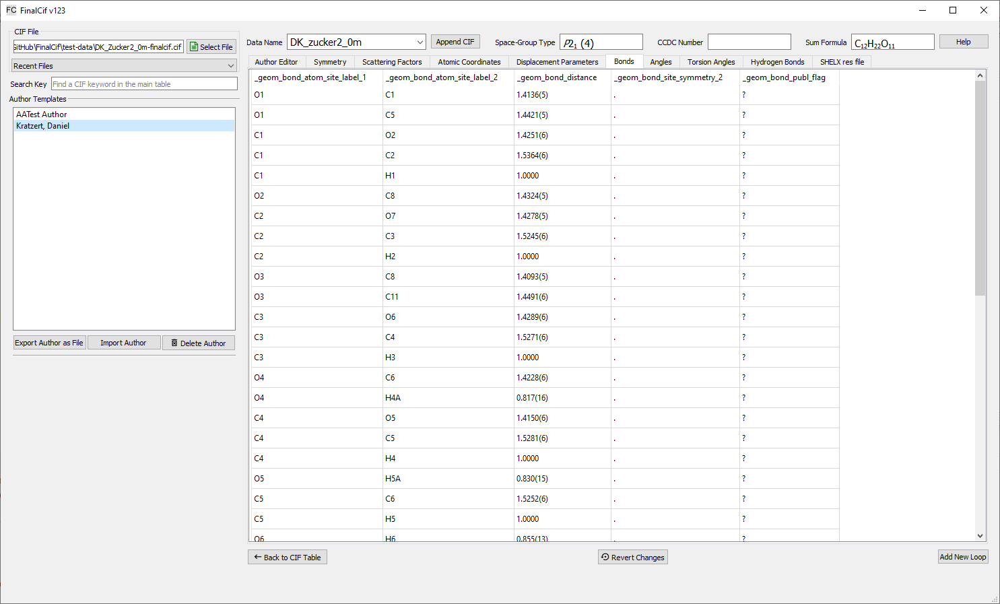
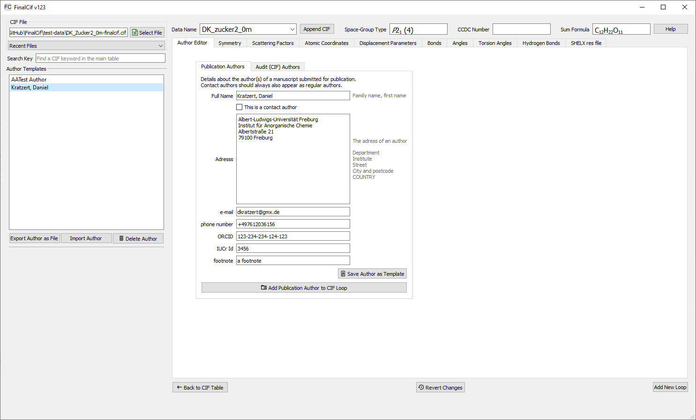

Loops
=====

General Loop Editor
-------------------

FinalCif is also able to edit loop data from a CIF file by clicking the "Edit Loops" button.
Each loop has its own tab where the loop data is represented as a table. All fields changed by the user
will turn pale red to indicate modifications and these are saved during the next file save.

Rows can be appended and deleted with a right click on a table.
The right-click menu also allows to change the ordering of loop rows by moving a row up or down.

The "revert changes" button reverts all changes done to the current loop, except for adding, deleting and moving rows.

   Atomic coordinates table (loop)

Author Editor
=============

FinalCif has a special editor for Author related loops.
The "Author Editor" tab contains an input mask to add author information for publication purpose as a cif loop.

This is not to be confused with the "Crystallographer Details" in the "Equipment and Author Templates" section.
With that, you just add a single \audit_author_[...] entry to the CIF.

New authors can be saved as templates for future use. The templates can be exported/imported to/from a CIF file.

The button "Add Author to CIF Loop" creates a loop or appends to an existing with the author information
of the currently selected author. The author type, i.e. publ- or audit-author, is controlled by the selection
of the corresponding tab. A template can be used for any author type.
Further aut hors get appended to the list of authors with the same button. The order of authors can be changed any time
by right-click on a table row and "Move Row up/down".

   Author editor.