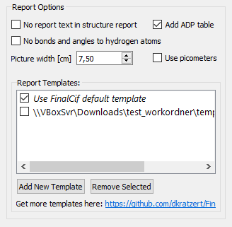

===============
Report Document
===============

FinalCif is able to render a nice looking report document as MS Word format from the information contained in the CIF.
For a complete report, you have to finish the CIF first.
It is also advisable to deposit the file before the report generation in order to have the CCDC number
listed in the report text.

.. figure:: pics/finalcif_report.png

   A report document example.

With a multi-CIF opened, also a report document where the values of all data\_ blocks are together in one table
is written to [filename]-multitable.docx.

.. figure:: pics/multitable.png

   A report document from a multi-CIF.

CCDC Number
-----------
There are two ways of introducing the CCDC number into the .cif file:

* Edit the 'CCDC Number' field in the top of FinalCif. The number will be saved in the key '_database_code_depnum_ccdc_archive'.
* Drag&Drop the deposition response email from the CCDC (`in EML format <https://www.loc.gov/preservation/digital/formats/fdd/fdd000388.shtml>`_) into the work folder and reload the .cif file.

Picture
-------
FinalCif can add a picture of your structure to the report document.

* Either by previously performing an html or local checkcif. Then it automatically adds a picture from the checkcif report, as in the example above.
* Or you can add any other picture with the "Picture for Report" button.
* A third possibility is the 'Show Details' page where you can use the current structure view as picture
  for the report:

   The Details page.

Bonds and Angles Tables
-----------------------
By default, the report document contains tables for bonds, angles, torsion angles and
hydrogen bonds of all atoms.
It is also possible to tabulate only a selection by entering 'y' or 'yes' at the
corresponding atom row in the _geom_[angle/bond/torsion/hbond]_publ_flag column of
the loop editor. On the other hand, 'n' or 'no' disables a table row.

Customizing the Report
----------------------

   Report options with two templates.

Do you have specific expectations regarding the appearance of the structure report?
With self-defined templates this is possible in FinalCif. You can find example templates
at https://github.com/dkratzert/FinalCif. It is easier to change them than to create them from scratch.

The templates are an ordinary MS Word document (more specific: Office Open XML, https://de.wikipedia.org/wiki/Office_Open_XML)
So you can use them with MS Word, Openoffice or Libre Office and other Office Open capable programs.

FinalCif uses the Jinja2 template language to exchange specific instructions in the templates with
precalculated information and direct values from the CIF file.
Be careful with the 'Track Changes' feature of MS Word. It tends to create incompatible
template documents, but it can be fixed with the 'accept all changes' option in Word. This accepts all
changes and the template document is behaving 'normal' again.

In the templates, you have two different types of information to add:

1. A variable, starting with {{ and ending with }}, for example: :code:`{{ a_variable }}`
   This would insert the content of the variable 'a_variable' at this point in the document
   during the report generation.

2. A block, starting with , for example:

.. code-block:: jinja

   Foo bar  Put this text here  Some other text.

This would put the text enclosed in the block into the document depending if either :code:`a_variable`
has a value or not.
The second possibility for blocks is to iterate over the values of a Python dictionary:

.. code-block:: jinja

   
      {{ atom.label }}
   

Produces a list of all atom names in a CIF.
If you need a table, :code:`` is used to generate table rows.

The information of the regular table loop can be extended by utilizing the Python zip function:

.. code-block:: jinja

    Atom	  x  	y	  z	   Ueq	  ADP type
    
        {{atom.label}}	{{ atom.x }}	{{ atom.y }}	{{ atom.z }}	{{ atom.u_eq }}	  {{ adp_type }}
    

That way, it is possible to access any column from the _atom_site loop.

This was only a brief introduction to what is possible with the Jinja template language.
The links at the end of this chapter go far mor into details.

Data Available for the Report
-----------------------------

.. code-block:: text

    'cif'                   : Gives you access to the full CIF information, use it like
                              {{ cif._exptl_crystal_density_diffrn }} or the variables in the next table.
    'name'                  : Name of the current CIF block.
    'block'                 : The context of all CIF blocks of a multi-CIF usable as attribute, e.g. block.name.foo or block['name'].foo
    'blocklist'             : A list of all CIF blocks of a multi-CIF usable for iteration over blocks.
    'atomic_coordinates'    : The atomic coordinates as ('label', 'type', 'x', 'y', 'z', 'u_eq', 'part', 'occ') for each atom.
    'displacement_parameters': The atomic displacement parameters as ('label', 'U11', 'U22', 'U33',
                               'U23', 'U13', 'U12') for each atom.
    'dist_unit'             : Unit for bond lengths (Angstrom or picometers).
    'vol_unit'              : Unit for unit cel volume (Angstrom^3 or namometers^3).
    'bonds'                 : The bonds with lengths as ('atoms', 'dist') for each atom pair.
    'angles'                : The bond angles as ('atoms', 'angle') for each atom triple.
    'ba_symminfo'           : The symmetry operations used to generate equivalent atoms in the angles list.
    'torsions'              : The torsion angles as ('atoms', 'angle') for each atom quartet.
    'torsion_symminfo'      : The symmetry operations used to generate equivalent atoms in the torsion angles list.
    'atoms_refinement'      : Automatic text describing the modelling and refinement of heavy atoms.
    'disorder_descr'        : Automatic text describing the modelling and refinement of disorder.
    'hydrogen_atoms'        : Automatic text describing the modelling and refinement of hydrogen atoms.
    'hydrogen_bonds'        : The hydrogen bonds (in case there are some defined with HTAB) as
                               ('atoms', 'dist_dh', 'dist_ha', 'dist_da', 'angle_dha').
    'hydrogen_symminfo'     : The symmetry operations used to generate equivalent atoms in the hydrogen bonds list
    'literature'            : A list of citations to the above used programs, e.g. literature.integration.richtext.
                              The richtext attribute formats the citation. Available literature:
                              ('integration', 'absorption', 'solution', 'refinement', 'ccdc', 'finalcif', 'dsr')
    'options'               : A dictionary with {'without_h': True/False, 'atoms_table': True/False,
                              'report_text': True/False, 'report_adp': True/False, 'bonds_table': True/False,
                              'use_picometers': True/False},
    'space_group'           : The space group formatted as formula object.
    'structure_figure'      : A picture selected with the 'Picture for Report' button.
    'crystallization_method': The value of '_exptl_crystal_recrystallization_method'
    'sum_formula'           : The formatted version of '_chemical_formula_sum' with subscript numbers.
    'moiety_formula'        : The formatted version of '_chemical_formula_moiety' with subscript numbers.
    'itnum'                 : The space group number from the international tables.
    'crystal_size'          : The crystal size as X x Y x Z.
    'crystal_colour'        : The crystal colour.
    'crystal_shape'         : The crystal shape.
    'radiation'             : The radiation type used like MoK_alpha.
    'wavelength'            : The wavelength in nm.
    'theta_range'           : The theta range.
    'diffr_type'            : The measurement device type.
    'diffr_device'          : The measurement device.
    'diffr_source'          : The radiation source.
    'monochromator'         : The monochromator.
    'detector'              : The detector model.
    'lowtemp_dev'           : The low-temperature device.
    'index_ranges'          : The preformatted index ranges.
    'indepentent_refl'      : The number of independent reflections.
    'r_int'                 : The R_int of the data.
    'r_sigma'               : The R_sigma of the data.
    'completeness'          : The completeness of the data.
    'theta_full'            : The resolution of the dataset in degree theta.
    'data'                  : the value of '_refine_ls_number_reflns'.
    'restraints'            : The value of '_refine_ls_number_restraints'.
    'parameters'            : The value of '_refine_ls_number_parameters'.
    'goof'                  : The value of '_refine_ls_goodness_of_fit_ref'.
    't_min'                 : The value of '_exptl_absorpt_correction_T_min'.
    't_max'                 : The value of '_exptl_absorpt_correction_T_max'.
    'ls_R_factor_gt'        : The value of '_refine_ls_R_factor_gt'.
    'ls_wR_factor_gt'       : The value of '_refine_ls_wR_factor_gt'.
    'ls_R_factor_all'       : The value of '_refine_ls_R_factor_all'.
    'ls_wR_factor_ref'      : The value of '_refine_ls_wR_factor_ref'.
    'diff_dens_min'         : The minimum residual density in e/A^3.
    'diff_dens_max'         : The maximum residual density in e/A^3.
    'exti'                  : The extinction coefficient.
    'flack_x'               : The value of the flack X parameter.
    'integration_progr'     : The name of the integration program used.
    'abstype'               : The value of '_exptl_absorpt_correction_type'.
    'abs_details'           : The name of the absortion correction program used.
    'solution_method'       : The structure solution method used.
    'solution_program'      : The name of the structure solution program.
    'refinement_prog'       : The name of the refinement program.
    'refinement_gui'        : The name of the graphical user interface used for model building and refienement.
    'refinement_details'    : The text of '_refine_special_details'.
    'resolution_angstrom'   : The resolution of the experiment in Å.
    'redundancy'            : The value of _diffrn_reflns_number / _reflns_number_total
    'bootstrap_css'         : Bootstrap CSS library used for a html report: https://getbootstrap.com/.
    'references'            : A list of references used in the document. Each reference can be accessed by its number, where
                              it can be accessed as html, richtext or text.

**Other useful information in the 'cif' variable:**

.. code-block:: text

   'cif.res_file_data'          : The SHELX .res file text.
   'cif.is_centrosymm'          : It true if the space group of the structure is centrosymmetric.
   'cif.atoms'                  : The list of atoms with 'label', 'type', 'x', 'y', 'z', 'part',
                                                         'occ', 'u_eq'.
   'cif.hydrogen_atoms_present' : Is true if hydrogen atoms are present in the structure.
   'cif.disorder_present'       : Is true if atoms in parts are present in the structure.
   'cif.cell'                   : The unit cell as 'a', 'b', 'c', 'alpha', 'beta', 'gamma', 'volume'.
   'cif.bonds'                  : The list of bonds as 'label1', 'label2', 'dist', 'symm'.
   'cif.bond_dist("atom1-atom2")'    : The bond distance between two atoms.
   'cif.angle("atom1-atom2-atom3")'  : The angle between three atoms.
   'cif.torsion("atom1-atom2-atom3-atom4")'  : The torsion angle between four atoms.
   'angles'                     : The list of angles as 'label1', 'label2', 'label3', 'angle_val',
                                  'symm1', 'symm2'.
   'torsion_angles'             : The list of torsion angles as 'label1', 'label2', 'label3', 'label4',
                                  'torsang', 'symm1', 'symm2', 'symm3', 'symm4'.
   'hydrogen_bonds'             : The list of hydrogen atoms involved in HTAB listings as 'label_d',
                                  'label_h', 'label_a', 'dist_dh', 'dist_ha', 'dist_da', 'angle_dha',
                                  'symm'.
   'test_res_checksum'          : True if the checksum of the SHELX .res file fits to the file content.
   'test_hkl_checksum'          : True if the checksum of the SHELX .hkl file fits to the file content.

The cif variable contains values from the CIF in ascii format directly. Be aware that negative values have a hyphen and
no real minus sign in front. The former listed values have hyphens replaced with minus signs.

The special methods listed above, allows you to access the values of the atoms, bonds, angles, torsion angles of single- and
multi-CIF files:

.. code-block:: jinja

    {{ block['p-1'].cif.bond_dist('C1-C2') }}
    {{ block['p-1'].cif.angle('C1-C2-C3') }}

Prints out the distance between C1 and C2 as well as the angle between C1, C2 and C3.
This can be used to render specific bond distances etc. of a multi-CIF
file to a publication without the need to change the values by hand every time a refinement changes.
Be aware that the atom labels must be given in the order they have in the respective CIF loop. When
an atom combination is not present in a CIF loop, the value 'None' will appear.

For a single-CIF, leave out the "block['block name']." part:

.. code-block:: jinja

    {{ cif.bond_dist('C1-C2') }}

The procedures in this chapter are not limited to the templates of FinalCif. It is also possible to insert template tags
into any other Word document and replace them with values from a CIF file. There are no limits to
the imagination.
Sine version 130, it is possible to address the values of individual blocks of a multi-CIF. For example,

.. code-block:: jinja

   
      {{ block.name }}
   

prints all block names of a multi-CIF.

Another option is to utilize the 'block' variable in the template. It holds the respective block data.
To access the values of the block, you need to use the block name in square brackets and
enclosed in quotation marks.
This prevents conflicts with Jinja2 syntax and potential characters in CIF blocks, such as the minus
sign in 'p-1', which would otherwise be interpreted as variable p minus one.
For example, the chemical formula of the block 'compound1' of a multi-CIF is:

.. code-block:: jinja

    {{ block['compound1']._chemical_formula_sum }}

Further information how to make templates for MS Office or Openoffice:
`https://docxtpl.readthedocs.io/en/latest/ <https://docxtpl.readthedocs.io/en/latest/>`_
`https://jinja.palletsprojects.com/en/3.1.x/ <https://jinja.palletsprojects.com/en/3.1.x/>`_