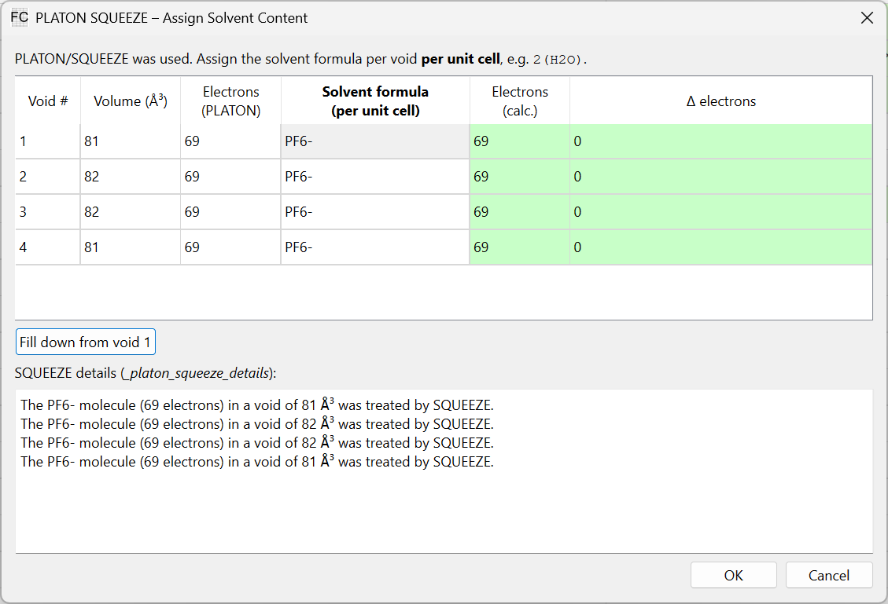

Solvent Masking (SQUEEZE / SMTBX)
==================================

When a crystal structure contains disordered solvent that cannot be modelled atomistically,
programs like PLATON SQUEEZE or Olex2/SMTBX solvent masks are used to account for the
electron density in the voids. FinalCif includes a dedicated dialog to document this
treatment properly in the CIF.

Automatic Detection
-------------------

FinalCif automatically detects when solvent masking has been applied:

* **PLATON SQUEEZE** – If the SHELX ``.res`` file contains an ``ABIN`` instruction and no
  ``_platon_squeeze_*`` loop is present in the CIF, FinalCif opens the SQUEEZE dialog on
  file load so the user can assign solvent content.
* **Olex2/SMTBX masks** – If a ``_smtbx_masks_*`` loop is present without a corresponding
  ``_smtbx_masks_special_details`` entry, the dialog opens in SMTBX mode.

The dialog can also be opened manually at any time via the **"Assign SQUEEZE content"**
button in the main window.

The Squeeze Dialog
------------------

   The solvent content assignment dialog (PLATON SQUEEZE mode shown).

The dialog displays one row per void found in the CIF (or imported ``.sqf`` file) with
the following columns:

* **Void #** – Sequential void number.
* **Volume (ų)** – Volume of the void as reported by the masking program.
* **Electrons (PLATON/Masks)** – Electron count determined by the masking program.
* **Solvent formula (per unit cell)** – Editable field where the user enters the chemical
  formula of the disordered solvent *per unit cell*, e.g. ``2(H2O)`` or ``C4H8O``.
* **Electrons (calc.)** – Electron count calculated from the entered formula.
* **Δ electrons** – Difference between the calculated and reported electron counts.
  A green background indicates a reasonable match (|Δ| ≤ 5 electrons); red signals a
  larger discrepancy that warrants review.

Entering Solvent Formulae
-------------------------

Formulae follow standard crystallographic notation:

* Simple molecules: ``H2O``, ``CHCl3``, ``C4H8O``
* Multiple molecules per void with a leading multiplier: ``2(H2O)``, ``3(CH2Cl2)``
* Space-separated notation (as produced by Olex2): ``2 H2O``

The **"Fill down from void 1"** button copies the formula from the first void to all
subsequent voids – useful when all voids contain the same solvent.

Details Text
------------

Below the table, a text field shows the auto-generated details text that will be written
to ``_platon_squeeze_details`` (SQUEEZE mode) or ``_smtbx_masks_special_details`` (SMTBX
mode). The text is regenerated automatically as you enter formulae.

You may freely edit the details text. Once manually modified, the auto-regeneration stops
so your changes are preserved.

Example of an auto-generated details entry::

    The C4H8O molecule (42 electrons) in a void of 248.3 ų was treated by SQUEEZE.

Importing .sqf Files
--------------------

If no SQUEEZE loop data is found in the CIF, FinalCif attempts to locate a ``.sqf`` file
(produced by PLATON or Olex2) in the same directory as the CIF. If no file is found
automatically, you are prompted to locate it manually via a file chooser.

The ``.sqf`` file is then imported into the CIF block and the dialog populates
accordingly. Olex2 ``.sqf`` files that use ``_smtbx_masks_*`` tags are also supported;
the dialog automatically switches to SMTBX mode when such tags are detected.

Writing Results
---------------

When you click **OK**:

1. The ``_*_void_content`` column in the void loop is updated with the entered formulae.
2. The details text is written to the appropriate CIF key
   (``_platon_squeeze_details`` or ``_smtbx_masks_special_details``).

Clicking **Cancel** discards all changes.

