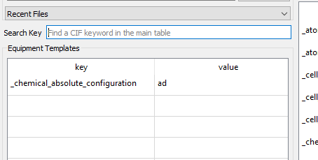

Templates
=========

FinalCif uses two different kinds of templates to to simplify recurring tasks:

* Equipment and Author templates
    They are useful for definitions of parameters like the properties of a measurement device
    or the name and address of the crystallographer. Apply template by double-clicking on one row.
* Property templates
    Property templates define possible dropdown-menus for common CIF keywords like _cell_measurement_temperature.
    The template values are accessible as a dropdown behind the respective key in the main table of FinalCif.

.. image:: pics/templates.png
The templates selection and editor.

You can anytime edit one of the templates and save them. You can use them for any cif keyword. 
Just be creative...

.. image:: pics/property_templates.png
Template editor for crystallization methods.

For example the crystallographer information:

.. image:: pics/equipment_templates.png
Crystallographer details template.

Or just one keyword for only the absolute configuration information:

Absolute configuration template.

Sidenote
--------
The predefined templates may change from time to time. To see the current version you have
to delete the predefined template (edit template-->delete).