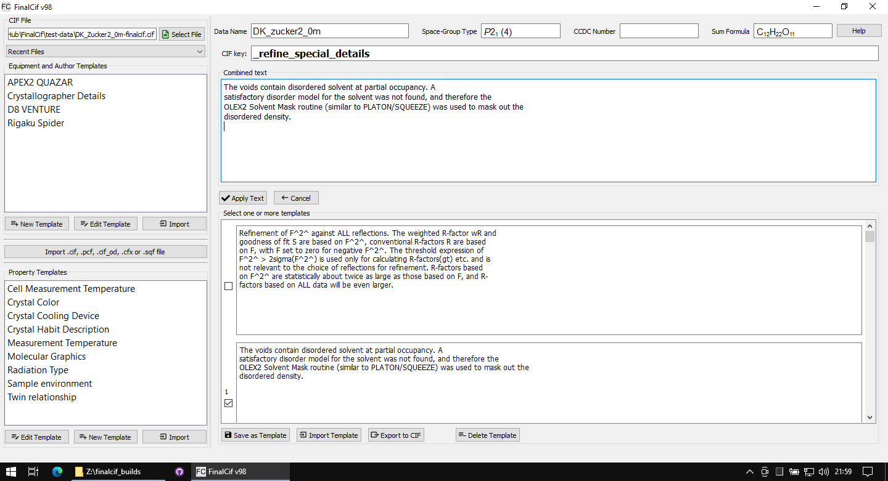
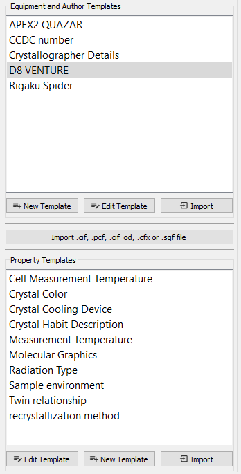
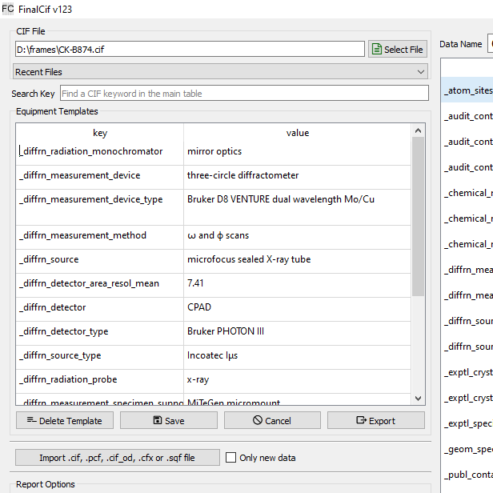
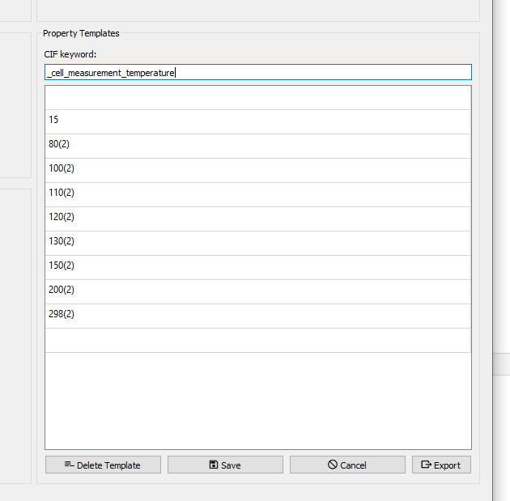

Templates
=========

FinalCif uses three different kinds of templates to simplify recurring tasks:

Large text templates
--------------------
    Each editable text field in the main table can hold text snippets as templates for reoccurring texts.
    The text template editor opens with the tiny 'edit' button that appears as long as the mouse cursor
    hovers over the field. Also a right-click in the main table on "Text Template" opens the editor.
    The editor is an a new page where the first line shows the CIF key from the row of the previous mouse click.
    In the large text field right-below, you can type any text and apply it with the "Apply Text" button,
    or you compose any kind of text snippets in the input fields left-below.
    These fields can be saved with the "Save as Template" button. A saved template is indicated with
    light-gray background color in the respective edit field of the main table.

The template editor for large text snippets.

    After you saved something as template, it will be loaded again if the editor is opened again
    on this same CIF key row. The trick here is that you can click the checkboxes before
    each text snippet to append the text of it to the "combined Text" field in click order.
    As any other templates in FinalCif, you can export/import them to CIF files.
    "Delete Template" deletes it from the configuration and will not show up again.
    So large text templates are usable either as a comfortable text editor and/or as template manager.
    For validation response forms, so CIF keywords starting with _vrf_, the template editor stores the
    template with the key _vrf_PLAT[number] rather than the full name. This also makes it usable as a
    template collection for validation responses with checkCIF.

Equipment templates
-------------------
    They are useful for definitions of parameters like the properties of a measurement device
    or the name and address of the crystallographer. Apply template by double-clicking the respective row.

The templates selection.

The equipment templates editor.

Property templates
------------------
    Property templates define possible dropdown-menus for common CIF keywords like _cell_measurement_temperature.
    After saving the respective template, its values are accessible as a dropdown menu behind the respective
    key in the main table of FinalCif.
    The property templates list is located on the Options page.

Template editor for crystallization methods.

Templates can be edited anytime and they can be saved as a CIF file. You can use them for any cif keyword.
Just be creative...

Sidenotes
---------

* As any other CIF, in order to import a template, it needs a \data_ keyword at the start.

* Templates may be multi-CIFs with multiple data\_ kewords for e.g. multiple machine definitions in one file.

