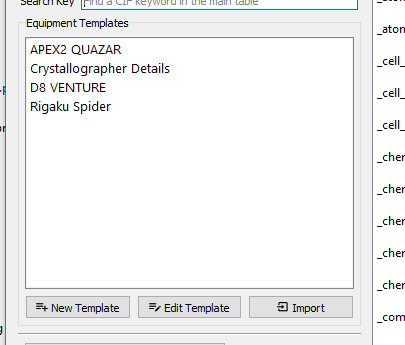

Templates
=========

FinalCif uses two different kinds of templates to to simplify recurring tasks:

* Equipment and Author templates
* Property templates

You can anytime edit one of the templates and save them. You can use them for any cif keyword. 
Just be creative...

.. image:: pics/property_templates.png

For example the cif author information:

.. image:: pics/equipment_templates.png

Or just one keyword for only the absolute configuration information:

.. image:: pics/absolute_configuration.png

Sidenote
--------
The predefined templates may change from time to time. To see the current version you have
to delete the predefined template (edit template-->delete).